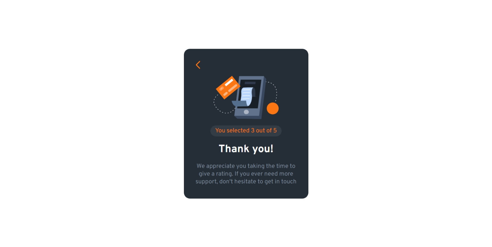

# Frontend Mentor - Interactive rating component solution

This is a solution to the [Interactive rating component challenge on Frontend Mentor](https://www.frontendmentor.io/challenges/interactive-rating-component-koxpeBUmI). Frontend Mentor challenges help you improve your coding skills by building realistic projects. 

## Table of contents

- [Overview](#overview)
  - [The challenge](#the-challenge)
  - [Screenshot](#screenshot)
  - [Links](#links)
- [My process](#my-process)
  - [Built with](#built-with)
  - [What I learned](#what-i-learned)
  - [Continued development](#continued-development)
- [Author](#author)

## Overview

### The challenge

Users should be able to:

- View the optimal layout for the app depending on their device's screen size
- See hover states for all interactive elements on the page
- Select and submit a number rating
- See the "Thank you" card state after submitting a rating

Things I added:

- An Alert when the user clicks submit without choosing a rating
- User shoudn't be able to go submitted page when a rating is not selected
- clicking outside will reset the rating choice 
### Screenshot

.png>)

### Links

- [Solution URL](https://github.com/HadjerL/frontend-mentor-interactive-rating-component.git)
- Live Site URL: [Add live site URL here](https://your-live-site-url.com)

## My process

### Built with

- Semantic HTML5 markup
- CSS custom properties
- Flexbox
- Mobile-first workflow

### What I learned

I have been learning Javascript for a while and now it's time to practice

### Continued development

Now I'll be working on learning react.

## Author

- GitHub - [HadjerL](https://github.com/HadjerL?tab=overview&from=2023-06-01&to=2023-06-21)
- Frontend Mentor - [HadjerL](https://www.frontendmentor.io/profile/HadjerL)
- Linkedin - [Hadjer Laissaoui](https://www.linkedin.com/in/hadjer-laissaoui-13a420255/)

